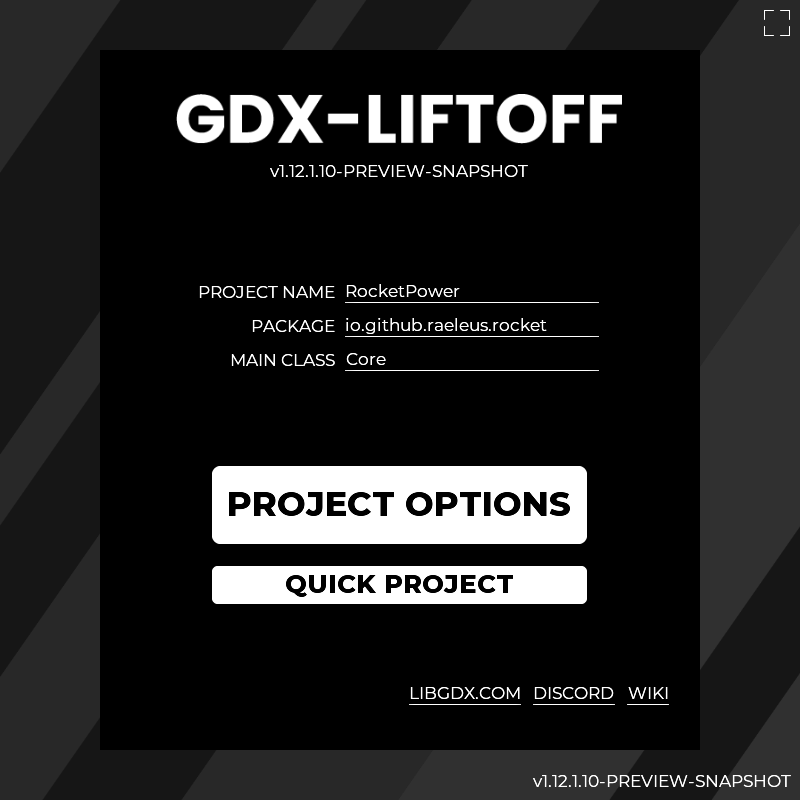

[](https://github.com/libgdx/gdx-liftoff/actions/workflows/build.yml)

# 🚀 gdx-liftoff 🚀

## 🎛 UI Redesign 🎛

A setup tool for [libGDX](https://libgdx.com/) Gradle projects.

[](https://github.com/libgdx/gdx-liftoff/releases)

<h1 style="text-align: center;">
    📥
    <strong><a href="https://github.com/libgdx/gdx-liftoff/releases">DOWNLOAD STABLE</a></strong>
    📥
<br>
    🎉
    Or, <a href="https://github.com/tommyettinger/gdx-liftoff-ui-redesign/releases">DOWNLOAD PREVIEW</a>
    🎉
</h1>

To generate a project, [download](https://github.com/libgdx/gdx-liftoff/releases) the latest application
`jar` and run it (usually double-clicking will do), or run the following command manually (replacing the `VERSION` appropriately):

```shell
java -jar gdx-liftoff-VERSION.jar
```

**You should use Java 17+ !** Android tools now require your installed JDK to be version 17 or higher.
You can still target other releases, as low as 8 typically, while building with any of the JDK versions 17 and up.
All stable releases of Java from 8 to 22 work here now.

If you have any trouble, you can try our new [🐛Troubleshooting Guide🐛](Troubleshooting.md).

## Features

In addition to most features of the original `gdx-setup`, the `gdx-liffoff` tool offers:
 
- **Project templates.** You can choose one of many project skeletons highlighting various libGDX features.
- **Instant input validation.** Your project data is validated as you type it in.
- **Other JVM languages support.** You can choose additional languages for your project, like Kotlin or Scala.
Their standard libraries, Gradle plugins, and appropriate source folders will be included.
- **Customization.** You have more control over the versions of software used by your application.
- **More third-party extensions.** Their versions are fetched from Maven Central or JitPack, so your project is always 
generated up-to-date.
- **Automatic configuration for tricky extensions.** If you're having trouble setting up
Artemis-ODB, Lombok, or several other libraries, Liftoff does some extra work, so you don't have to. 
- **Preferences support.** Basic data of your application is saved, so you don't have to fill it each time
you generate a project.
- **Optional Gradle runner.** You can optionally execute Gradle tasks after project generation. Gradle doesn't have to
run for a project to be created.
- **Supports all libGDX backends.** Do you need the LWJGL2, LWJGL3, and/or Headless backends? Liftoff
provides simple checkboxes to add any and all official platforms, plus some special other modules.
- **Convenience features.** If you have JetBrains Toolbox, you can open a just-generated project in IDEA with one click
(it needs "Generate Shell Scripts" set in Toolbox). If you use Eclipse, you can still import Gradle projects normally.
- **Up-to-date.** This project prides itself on updating quickly after releases of major external components such
as Gradle or libGDX itself.
- **More backends are supported.** The headless backend has been part of libGDX for a long time, but wasn't easily
accessed in gdx-setup; it is a checkbox here. TeaVM, an increasingly-popular alternative to GWT for browser-based 
applications, is also here, and works with Kotlin and other JVM languages as well as it does with Java.

## Guide

Gdx-Liftoff is a relatively straightforward GUI application; you enter a project name/package/path, you select options
on the tabs you want to change, and you click "Generate Project". After that you can open the project in the path you
specified, or open it more quickly in IDEA if it's installed how Liftoff can see it (using
[JetBrains Toolbox](https://www.jetbrains.com/toolbox-app/), most likely). You can add official extensions such as
`Box2D` on the Extensions tab, or third-party extensions such as `Artemis-ODB` on the `Third-Party` tab. You can also
choose languages on the Languages tab, and starting templates on the Templates tab. If you want to use Kotlin, a Kotlin
template is recommended (such as `Kotlin Logo`).

Some things are structured differently in Liftoff projects, compared to gdx-setup projects. Where gdx-setup puts almost
all configuration in `/build.gradle` (in the project root), including for subprojects like `android` or `html`, Liftoff
puts only shared configuration in the root `build.gradle`, keeps all user-configurable version information in
`/gradle.properties`, and moves per-project configuration to `/core/build.gradle`, `/android/build.gradle`,
`/html/build.gradle`, etc. Liftoff also calls the project that depends on LWJGL3 `lwjgl3`, since you can also create a
project that depends on LWJGL2, and that's called `lwjgl2`. You might need to change references to the "desktop" module
(as gdx-setup calls LWJGL3) to `lwjgl3`, since that's the most likely desktop module you would be using.

If you're adding dependencies to build.gradle files, you will probably need to add them to `/core/build.gradle` rather
than `/build.gradle` in the root. Some dependencies may also need parts added to `/lwjgl3/build.gradle`,
`/html/build.gradle`, and so on. If a library says to add lines to the dependencies section, that almost always means
the block inside `dependencies { }`, but **not** inside `buildscript { }`. There are often two dependencies blocks, and
you generally want the last one. Templates selected in Liftoff handle this automatically.

For more details on how to use the application and how it works, see the [usage guide](Guide.md).
If you would like to contribute to the project, you might find the [architecture document](Architecture.md)
helpful.

When submitting a pull request, please format the application with the `ktlintFormat` Gradle task.

## Credits

The project was forked from the [`czyzby/gdx-setup`](https://github.com/czyzby/gdx-setup) repository.
[@czyzby](https://github.com/czyzby) and [@kotcrab](https://github.com/kotcrab) have created the original application,
as well as a set of libraries that it depends on (`gdx-lml` and VisUI respectively). Since then, the project is
maintained by [@tommyettinger](https://github.com/tommyettinger). Graciously, czyzby came back and made a wide variety of improvements, so big
thanks there! Thanks also to [@metaphore](https://github.com/metaphore), who now maintains gdx-lml (which this uses).

[@raeleus](https://github.com/raeleus) created the
[Particle Park skin for scene2d.ui](https://ray3k.wordpress.com/particle-park-ui-skin-for-scene2d-ui/),
which was adapted to be the default skin added to new projects (if the _"Generate UI Assets"_ option is selected).
"Accademia di Belle Arti di Urbino and students of MA course of Visual design" has created the _Titillium Web_
font that the skin uses (under SIL OFL license).

Other project contributors include [@Mr00Anderson](https://github.com/Mr00Anderson), [@lyze237](https://github.com/lyze237),
[@metaphore](https://github.com/metaphore) (again!), and [@payne911](https://github.com/payne911).
People who haven't directly contributed code have still helped a lot by spending their time to test on platforms
like macOS and iOS; [@JojoIce](https://github.com/JojoIce) is one of several people who made a difference regarding iOS. And of course,
many thanks go to all the early adopters for putting up with any partially-working releases early on!

The randomized icons chopped up and used for Android projects come from the [OpenMoji](https://openmoji.org) project.
If you want to use these icons in a less-mangled format, there's
[openmoji-atlas](https://github.com/tommyettinger/openmoji-atlas) to access these emoji from libGDX conveniently.

---

Good luck, and we hope you make something great!
